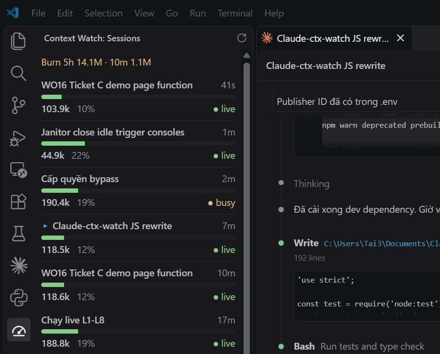

# Context Watch for Claude Code

**See the context window and the token burn of every Claude Code session on your machine, in one
VS Code sidebar panel.**

> Unofficial community extension. Not affiliated with or endorsed by Anthropic.

## Why it exists

The desktop app loads its own tool surface into every session, and you pay for that before you type
a word. Measured on this machine across 11 sessions (18–20 Sep 2026), the
**context floor** — what is already in the window at the first assistant turn — ran **107,452 to
124,902 tokens, median 117,737**. A floor is not paid once. It sits underneath every later turn of
that session as cache read, so it is the one number that multiplies by everything else you do.

Opening the same project through the VS Code extension instead: **70,623**. Same repo, same
`CLAUDE.md`, same day, only the client changed — **36,829 tokens lighter, a third of the floor
gone**, on every turn of the session.

That move has a price, and this repo is the price. The app's context view stays in the app, and the
custom statusline does not render inside the extension pane — so the number you switched clients to
lower is exactly the number you can no longer see. Context Watch gives it back from outside any
client, and gives back more than was lost: not one window, but every session on the machine.

- **Which window is about to run out of context.** `/context` answers for the window you are typing
  in, and only when you stop and ask it. The others say nothing until one of them silently
  auto-compacts in the middle of a task you cared about.
- **What all of them together are doing to your quota.** Claude Code never adds spend up across
  sessions. A subagent fan-out in a window you are not watching can drain a 5-hour quota while you
  are away from the keyboard — and afterwards nothing tells you which window did it.

Both, refreshed every 5 seconds, in a panel you park beside your work.

## What you get

- **A Context Watch panel** with its own icon on the Activity Bar. One card per session: the name the
  Claude Code tab shows, tokens in context, % of the model's window, and whether the session is
  `busy`, `live` or `closed`. Drag the panel to the secondary sidebar to keep it beside your editor.
- **A status bar item** with the % context of the live session in the current workspace. It turns
  yellow at 75% and red at 90%. Click it to open the panel. The panel opens by itself after install; later, run **Context Watch: Show Sessions** from the Command Palette if the Activity Bar is hidden.
- **A burn line**: quota used on this machine in the last 5 hours and 10 minutes, across all sessions
  and their subagents, deduplicated per API request.

## Privacy

Context Watch **reads local files only and sends nothing over the network.** It has no telemetry
and no network code. It reads, without modifying:

- `~/.claude/projects/**/*.jsonl` (session transcripts: token usage and tab titles only)
- `~/.claude/sessions/*.json` (which sessions are running)

It works in Claude Code from the VS Code extension, the CLI, and the desktop app, since they all
write these files. In a Remote (SSH / WSL / container) window it reads the remote machine's files,
which is where Claude Code runs.

## Settings

| Setting | Default | |
|---|---|---|
| `ctxWatch.refreshSeconds` | `5` | How often to re-read session files. |
| `ctxWatch.recentMinutes` | `30` | How long closed sessions stay listed. Live sessions are always shown. |
| `ctxWatch.contextWindows` | `{}` | Window size per model, prefix match, e.g. `{ "claude-sonnet-5": 1000000 }`. |
| `ctxWatch.showBurn` | `true` | Show the burn line. |
| `ctxWatch.statusBar` | `true` | Show the status bar item. |
| `ctxWatch.claudeDir` | `""` | Data directory. Empty = `$CLAUDE_CONFIG_DIR`, else `~/.claude`. |

### Context window sizes

Built in: `claude-opus-5*` = 1M, `claude-haiku-4-5*` = 200k. Any other model shows `window ?`
instead of a guessed percentage; add it to `ctxWatch.contextWindows` to get a bar.

### How burn is counted

Tokens are weighted as input-equivalents: input ×1, cache write ×2, cache read ×0.1, output ×5. The
line turns yellow above 1M in 10 minutes and red above 3M.

## Limits

Context Watch reads Claude Code's internal file formats, which are undocumented and can change in any
Claude Code release. If the panel goes empty after an update, please
[open an issue](https://github.com/anhtaicn/context-watch-for-claude-code/issues). Errors are logged to the
**Context Watch** output channel.

## License

MIT
